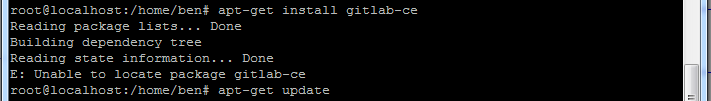

# Cent OS
## 开启/关闭防火墙

CentOS Linux开启和关闭防火墙命令有两种，一种是临时的，重启即复原；另外一种是永久性的，重启不会复原。
 
1. 临时生效，重启后复原
 - 开启： service iptables start
 - 关闭： service iptables stop
 
2. 永久性生效，重启后不会复原
 - 开启： chkconfig iptables on
 - 关闭： chkconfig iptables off
 ``
对于Linux下的其它服务都可以用以上命令执行开启和关闭操作。

# Ubuntu 
> Ubuntu 很多地方与CentOS是不同的，一些常用的操作还是比较特殊的。 比如 iptables 的操作就是不同； vim 安装的版本也是不一样的，还需要安装完整的版本。 

## 按装完 Ubuntu 16 需要做的几件事

1. 修改 root 的密码， 之后用 root 登入。
 - 先用安装时候的用户登录进入系统
 - 输入：`sudo passwd` ，按回车
 - 输入新密码，重复输入密码，最后提示passwd：password updated sucessfully
 - 此时已完成root密码的设置
 - 输入：`su root` ，切换用户到root试试.......
2. 升级 vim
 - `apt-get install vim-gtk` 
3. 设置静态 IP
 - **sudo vim /etc/network/interfaces**
 ```
 auto ens33  # 注意在虚拟机中，直接修改 auto ens33 <换行> iface ens33 inet dhcp 即可。
 iface ens33 inet static
 address 192.168.0.117
 gateway 192.168.0.1 #这个地址你要确认下 网关是不是这个地址
 netmask 255.255.255.0
 netqwork 192.168.0.0
 broadcast 192.168.0.255
 ```
4. **重启网卡**
 - sudo /etc/init.d/networking restart
5. 重新设置 DNS
 - sudo vim /etc/resolv.conf    （临时修改）
 - sudo vim /etc/resolvconf/resolv.conf.d/base  (永久更改)
 - -
 - **在 base 中输入：**
 - nameserver 219.141.136.10
 - nameserver 219.141.140.10

6. 安装SSH, 默认情况下ssh协议使用端口22。
 - apt-get install ssh
 - 通过命令 `ps -e |grep ssh`，查看 ssh 的启动情况，假如没有启动的话，通过 `/etc/init.d/ssh start` 来启动 ssh 服务。
7. 设置时区：
 - `sudo cp /usr/share/zoneinfo/Asia/Shanghai  /etc/localtime`
 
## 安装 gitlab .
1. 更新一下 apt-get, `sudo apt-get update`
2. 使用国内安装源镜像，加快安装速度。 修改/etc/apt/sources.list.d/gitlab-ce.list，添加以下行
 - `deb https://mirrors.tuna.tsinghua.edu.cn/gitlab-ce/debian jessie main`
3. 安装依赖包
 - `sudo apt-get install curl openssh-server ca-certificates postfix`
4. 安装 GitLab 社区版
 - apt-get install gitlab-ce
 - 注意，安装时如果出现下面的错误，请执行`sudo apt-get update`。
 - 
5. 配置。
 - `vi /etc/gitlab/gitlab.rb`
 - **外网端口号**：
 - > 修改为： `external_url 'http://<外网地址 或 IP，不带端口号>'`。
 - **配置默认端口**:
 - unicorn['port'] = 8082 , ** 配置失败，需要 和 Nginx 联合配置**。
5. 初始化，初始化完自动启动 GitLab 
 - sudo gitlab-ctl reconfigure
6. 在局域网或外部的 Windows 的浏览器中输入，`http://<ubuntu 的 IP 地址>`, 回车。 你会发现惊喜 ：）。

## 卸载 gitlab

```bash
sudo gitlab-ctl uninstall
```
## 运维 gitlab

```sh

# 修改默认的配置文件
sudo vim /etc/gitlab/gitlab.rb

// 查看版本
sudo cat /opt/gitlab/embedded/service/gitlab-rails/VERSION

// echo "vm.overcommit_memory=1" >> /etc/sysctl.conf
// sysctl -p
// echo never > /sys/kernel/mm/transparent_hugepage/enabled

// 检查gitlab
gitlab-rake gitlab:check SANITIZE=true --trace

// 查看日志
sudo gitlab-ctl tail

# 数据库关系升级
sudo gitlab-rake db:migrate

# 清理缓存
sudo gitlab-rake cache:clear

sudo gitlab-rake gitlab:check
sudo gitlab-rake gitlab:check SANITIZE=true

# 升级gitlab
sudo yum install gitlab-ce

# 升级数据命令
sudo gitlab-ctl pg-upgrade
```

```bash 
# 启动所有 gitlab 组件：
sudo gitlab-ctl start

# 停止所有 gitlab 组件：
sudo gitlab-ctl stop

# 停止所有 gitlab postgresql 组件：
sudo gitlab-ctl stop postgresql

# 停止相关数据连接服务
sudo gitlab-ctl stop unicorn
sudo gitlab-ctl stop sidekiq

# 重启所有 gitlab 组件：
sudo gitlab-ctl restart

# 重启所有 gitlab gitlab-workhorse 组件：
sudo gitlab-ctl restart  gitlab-workhorse

# 查看服务状态
sudo gitlab-ctl status

# 生成配置启动服务
sudo gitlab-ctl reconfigure
```

```bash
# 查看日志
sudo gitlab-ctl tail

# 检查redis的日志
sudo gitlab-ctl tail redis
 
# 检查postgresql的日志
sudo gitlab-ctl tail postgresql
 
# 检查gitlab-workhorse的日志
sudo gitlab-ctl tail gitlab-workhorse
 
# 检查logrotate的日志
sudo gitlab-ctl tail logrotate
 
# 检查nginx的日志
sudo gitlab-ctl tail nginx
 
# 检查sidekiq的日志
sudo gitlab-ctl tail sidekiq
 
# 检查unicorn的日志
sudo gitlab-ctl tail unicorn

```

### 重置管理员密码

gitlab管理员密码忘记，怎么重置密码，Gitlab 修改root用户密码

使用rails工具打开终端

```bash
sudo gitlab-rails console production
```

查询用户的email，用户名，密码等信息，id:1 表示root账号

```bash
user = User.where(id: 1).first
```

重新设置密码

```bash
user.password = '新密码'
user.password_confirmation = '新密码'　
```

保存密码

```bash
user.save!
```

完整的操作ruby脚本

```bash
user = User.where(id: 1).first
user.password = '新密码'
user.password_confirmation = '新密码'
user.save!
```
## 备份恢复

使用Gitlab一键安装包安装Gitlab非常简单, 同样的备份恢复与迁移也非常简单,用一条命令即可创建完整的Gitlab备份:

### 修改备份文件默认目录

修改`/etc/gitlab/gitlab.rb`来修改默认存放备份文件的目录:

```bash
gitlab_rails['backup_path'] = '/mnt/backups'  
```

### 创建备份

```bash
gitlab-rake gitlab:backup:create
```

以上命令将在/var/opt/gitlab/backups目录下创建一个名称类似为xxxxxxxx_gitlab_backup.tar的压缩包, 这个压缩包就是Gitlab整个的完整部分, 其中开头的xxxxxx是备份创建的时间戳。

修改后使用gitlab-ctl reconfigure命令重载配置文件。
- 授权备份目录，以便 WinSCP 下载备份程序。
```
sudo chmod 600 ××× （只有所有者有读和写的权限）
sudo chmod 644 ××× （所有者有读和写的权限，组用户只有读的权限）
sudo chmod 700 ××× （只有所有者有读和写以及执行的权限）
sudo chmod 666 ××× （每个人都有读和写的权限）
sudo chmod 777 ××× （每个人都有读和写以及执行的权限）

sudo chmod 777 -R /var/opt/gitlab/backups  // -R 是递归的授权子路径的意思。
```
### 开始备份

```bash
gitlab-rake gitlab:backup:create
```

这里放你的备份文件文件夹，和仓库源文件。

```bash
/var/opt/gitlab/backups                   # 备份文件文件夹
/var/opt/gitlab/git-data/repositories     # git仓库源文件
```

### 自动备份

通过crontab使用备份命令实现自动备份

```bash
crontab -e
# 每天2点备份gitlab数据
0 2 * * * /usr/bin/gitlab-rake gitlab:backup:create
0 2 * * * /opt/gitlab/bin/gitlab-rake gitlab:backup:create
```
> 在保存之后，根据屏幕下面的提示输入Ctrl+X退出，此时会提示是否保存，输入Y；提示输入文件名，并且有一个临时的文件名，由于只是测试，直接回车保存。

上面两行保存之后，重新载入配置

```bash
// ubunto 
sudo /etc/init.d/cron restart
// cent os
sudo /sbin/service crond reload
```

### 备份保留七天

设置只保存最近7天的备份，编辑 /etc/gitlab/gitlab.rb 配置文件，找到如下代码，删除注释 `#` 保存

```bash
# /etc/gitlab/gitlab.rb 配置文件 修改下面这一行
gitlab_rails['backup_keep_time'] = 604800  
```

重新加载gitlab配置文件

```bash
sudo gitlab-ctl reconfigure  
```

### 开始恢复

迁移如同备份与恢复的步骤一样, 只需要将老服务器/var/opt/gitlab/backups目录下的备份文件拷贝到新服务器上的/var/opt/gitlab/backups即可(如果你没修改过默认备份目录的话)。 然后执行恢复命令。
如果修改了，首先进入备份 gitlab 的目录，这个目录是配置文件中的 `gitlab_rails['backup_path']` ，默认为 `/var/opt/gitlab/backups` 。

然后停止 unicorn 和 sidekiq ，保证数据库没有新的连接，不会有写数据情况。

```bash
# 停止相关数据连接服务
gitlab-ctl stop unicorn
# ok: down: unicorn: 0s, normally up
gitlab-ctl stop sidekiq
# ok: down: sidekiq: 0s, normally up

# 从xxxxx编号备份中恢复
# 然后恢复数据，1406691018为备份文件的时间戳
gitlab-rake gitlab:backup:restore BACKUP=1406691018

# 新版本 1483533591_2017_01_04_gitlab_backup.tar
gitlab-rake gitlab:backup:restore BACKUP=1483533591_2017_01_04_gitlab_backup.tar

# 启动Gitlab
sudo gitlab-ctl start  
```


判断是执行实际操作的gitlab相关用户：git，没有得到足够的权限。依次执行命令：

```bash
# 恢复过程中没有权限
mkdir /var/opt/gitlab/backups
chown git /var/opt/gitlab/backups
chmod 700 /var/opt/gitlab/backups

# 恢复成功页面报没有权限的错误
sudo chown -R git:git /var/opt/gitlab/git-data/repositories
sudo chmod -R ug+rwX,o-rwx /var/opt/gitlab/git-data/repositories
sudo chmod -R ug-s /var/opt/gitlab/git-data/repositories
sudo find /var/opt/gitlab/git-data/repositories -type d -print0 | sudo xargs -0 chmod g+s
```
