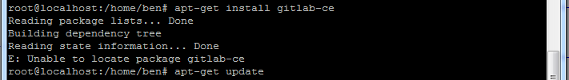

# Ubuntu 
> Ubuntu 很多地方与CentOS是不同的，一些常用的操作还是比较特殊的。 比如 iptables 的操作就是不同； vim 安装的版本也是不一样的，还需要安装完整的版本。 

## 按装完 Ubuntu 16 需要做的几件事

1. 修改 root 的密码， 之后用 root 登入。
 - 先用安装时候的用户登录进入系统
 - 输入：`sudo passwd` ，按回车
 - 输入新密码，重复输入密码，最后提示passwd：password updated sucessfully
 - 此时已完成root密码的设置
 - 输入：`su root` ，切换用户到root试试.......
2. 升级 vim
 - `apt-get install vim-gtk` 
3. 设置静态 IP
 - **sudo vim /etc/network/interfaces**
 ```
 auto ens33  # 注意在虚拟机中，直接修改 auto ens33 <换行> iface ens33 inet dhcp 即可。
 iface ens33 inet static
 address 192.168.0.117
 gateway 192.168.0.1 #这个地址你要确认下 网关是不是这个地址
 netmask 255.255.255.0
 netqwork 192.168.0.0
 broadcast 192.168.0.255
 ```
4. **重启网卡**
 - sudo /etc/init.d/networking restart
5. 重新设置 DNS
 - sudo vim /etc/resolv.conf    （临时修改）
 - sudo vim /etc/resolvconf/resolv.conf.d/base  (永久更改)
 - -
 - **在 base 中输入：**
 - nameserver 219.141.136.10
 - nameserver 219.141.140.10

6. 安装SSH, 默认情况下ssh协议使用端口22。
 - apt-get install ssh
 - 通过命令 `ps -e |grep ssh`，查看 ssh 的启动情况，假如没有启动的话，通过 `/etc/init.d/ssh start` 来启动 ssh 服务。
7. 设置时区：
 - `sudo cp /usr/share/zoneinfo/Asia/Shanghai  /etc/localtime`
 
## 安装 gitlab .
1. 更新一下 apt-get, `sudo apt-get update`
2. 使用国内安装源镜像，加快安装速度。 修改/etc/apt/sources.list.d/gitlab-ce.list，添加以下行
 - `deb https://mirrors.tuna.tsinghua.edu.cn/gitlab-ce/debian jessie main`
3. 安装依赖包
 - `sudo apt-get install curl openssh-server ca-certificates postfix`
4. 安装 GitLab 社区版
 - apt-get install gitlab-ce
 - 注意，安装时如果出现下面的错误，请执行`sudo apt-get update`。
 - 
5. 配置。
 - `vi /etc/gitlab/gitlab.rb`
 - **外网端口号**：
 - > 修改为： `external_url 'http://<外网地址 或 IP，不带端口号>'`。
 - **配置默认端口**:
 - unicorn['port'] = 8082 , ** 配置失败，需要 和 Nginx 联合配置**。
5. 初始化，初始化完自动启动 GitLab 
 - sudo gitlab-ctl reconfigure
6. 在局域网或外部的 Windows 的浏览器中输入，`http://<ubuntu 的 IP 地址>`, 回车。 你会发现惊喜 ：）。

## 卸载 gitlab

```bash
sudo gitlab-ctl uninstall
```